<h2>Activité Pratique N°3 - Spring MVC avec Thymeleaf---Partie 1--- </h2>
<h3>Architecture du projet</h3>
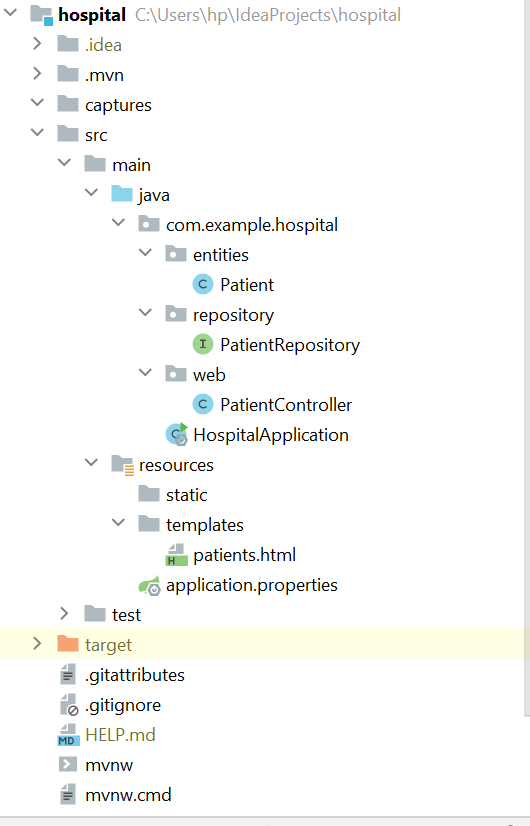
<h3>Class Patient</h3>
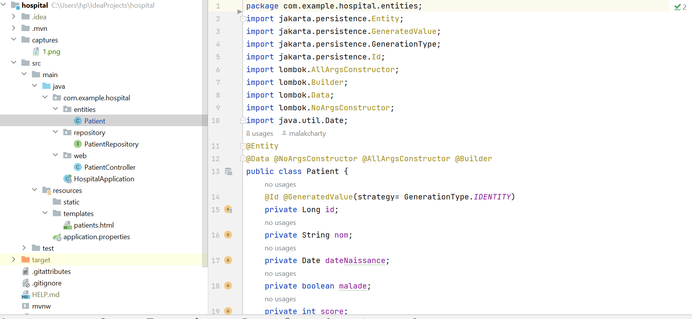
<h3> Interface PatientRepository</h3>
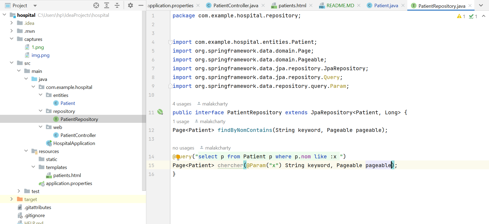
<h3>Patient Controller</h3>
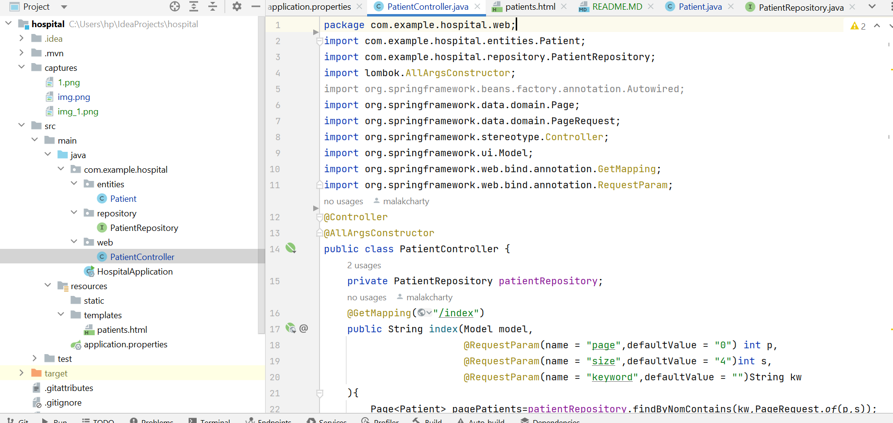
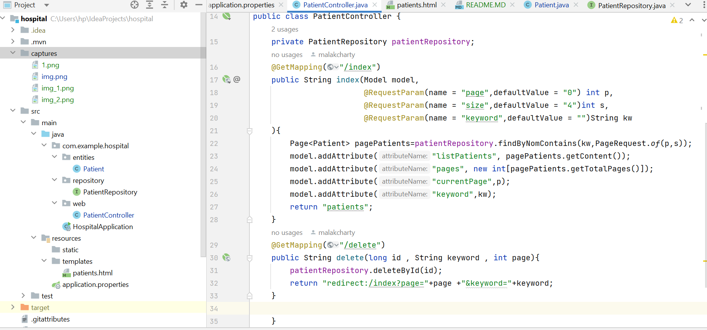
<h3> HospitalApplication</h3>
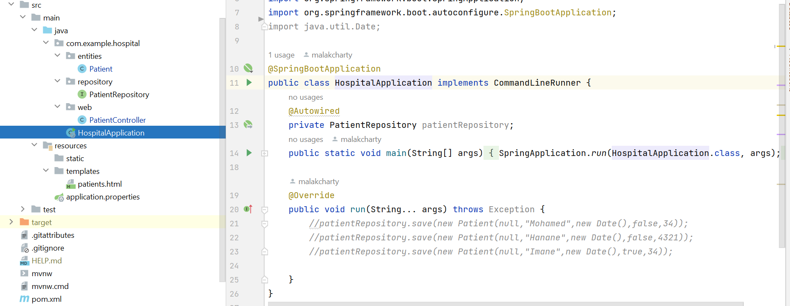
<h3> patients.html</h3>
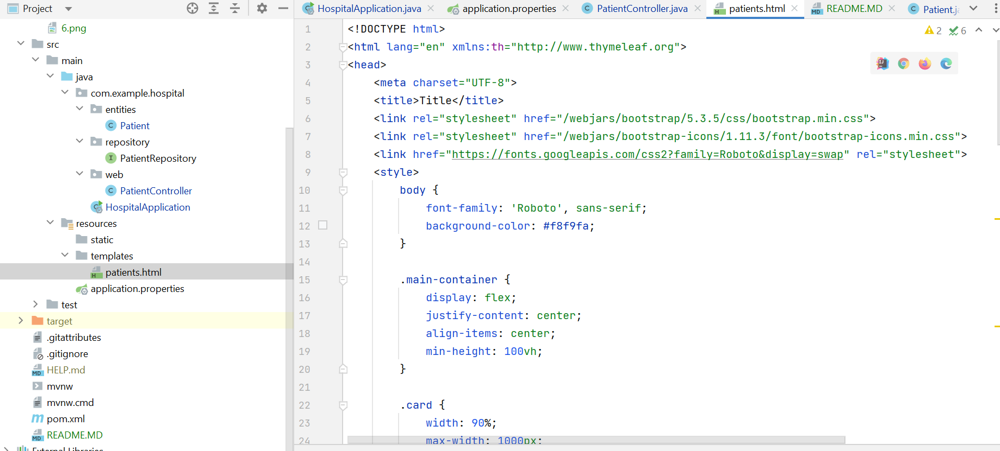
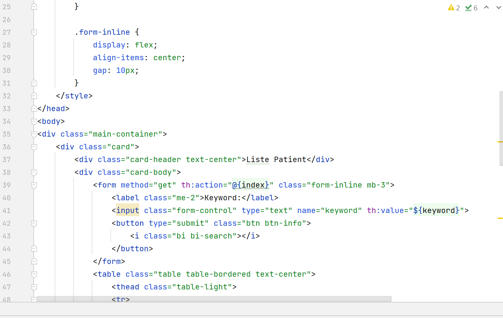
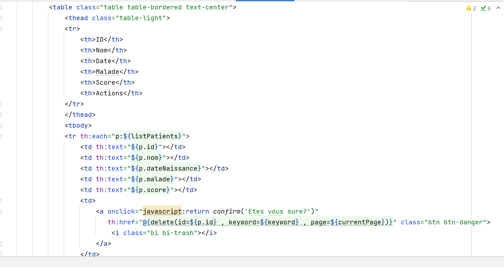
<h3> application.properties</h3>
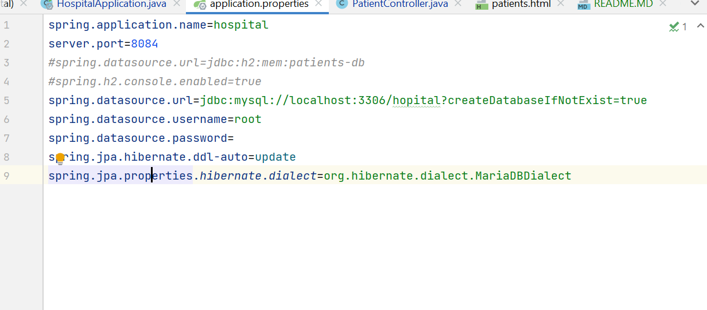
<h3> pom.xml</h3>
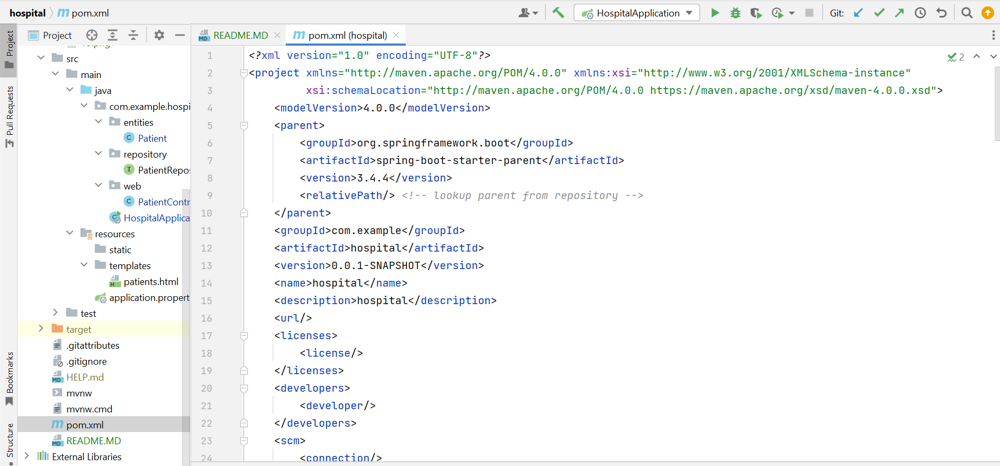
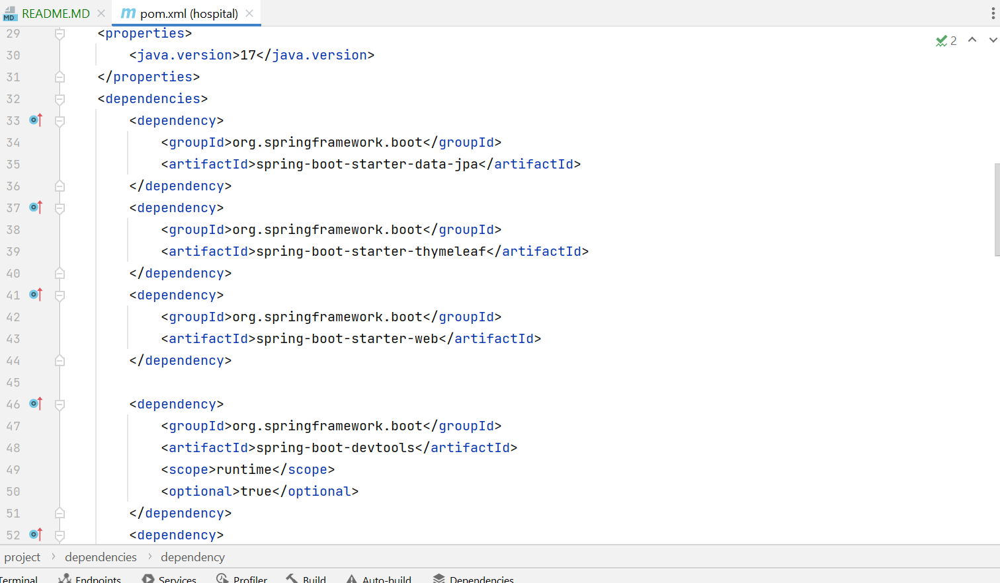
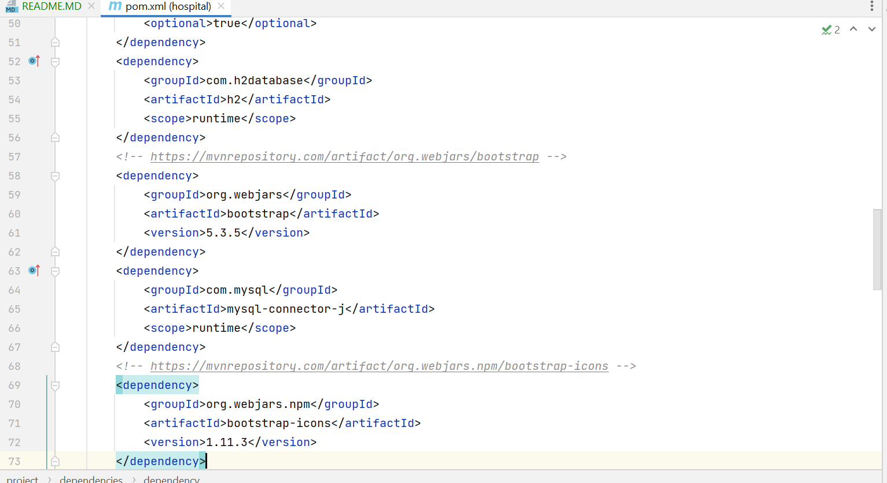
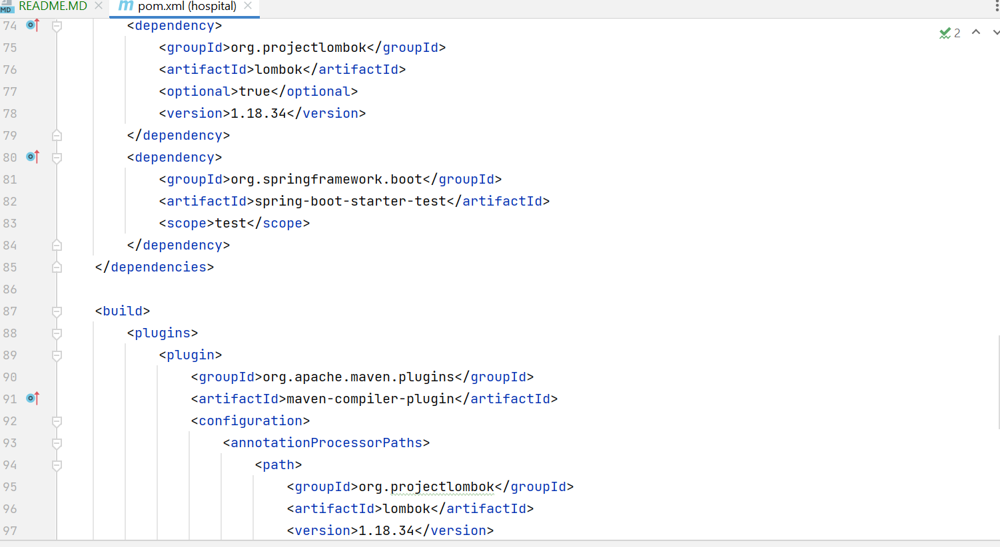
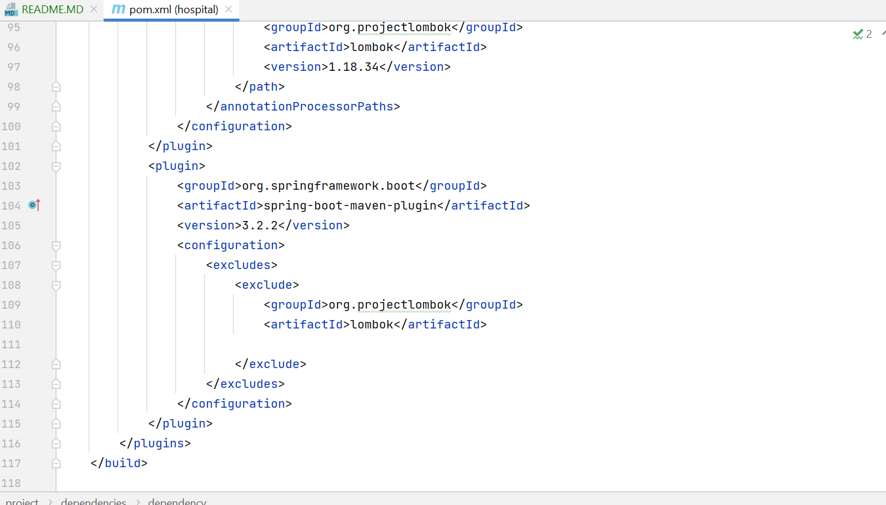
<h3> Base de donnée H2 </h3>
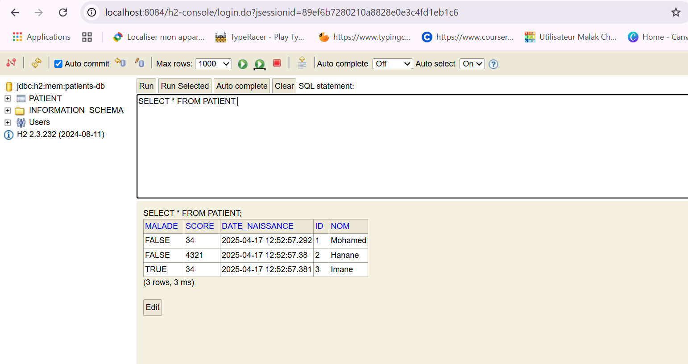
<h3>Rendu HTML apres boostrap</h3>
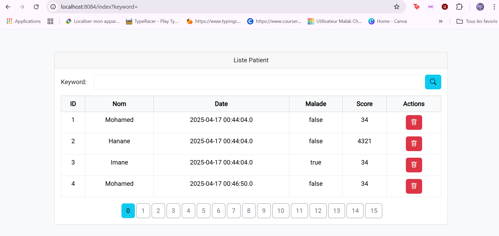
<h3>Rendu HTML en cherchant Mohamed </h3>
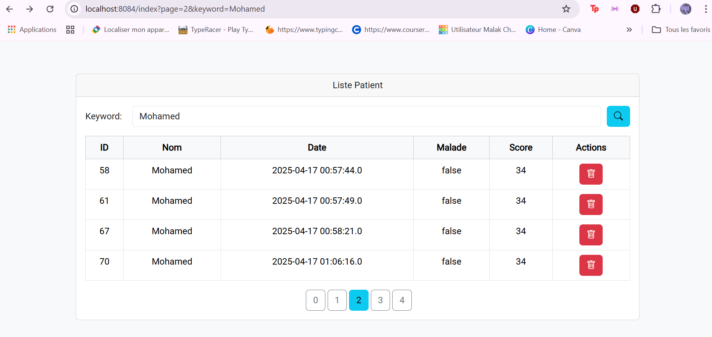
<h3>Affichage d'un message pour confirmer la suppresion</h3>
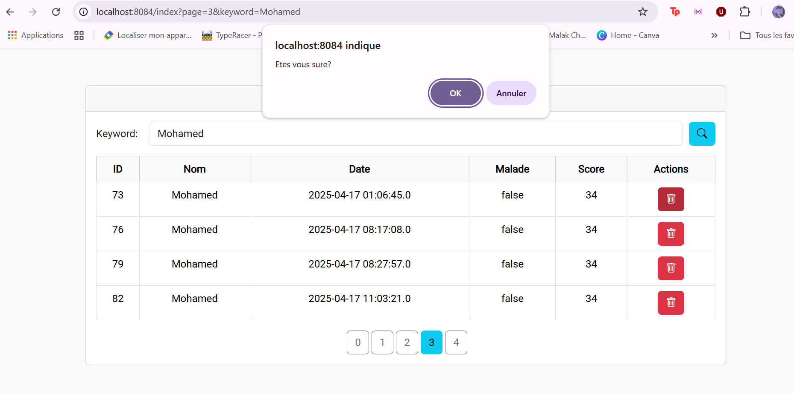
<h3>Rendu HTML aprés suppression du produit dont l'ID est 73  </h3>
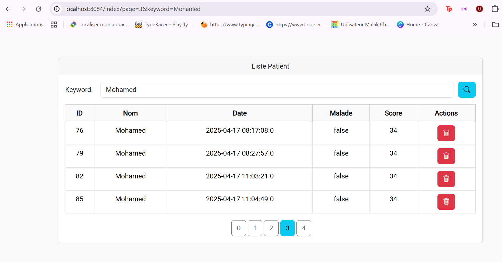